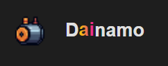
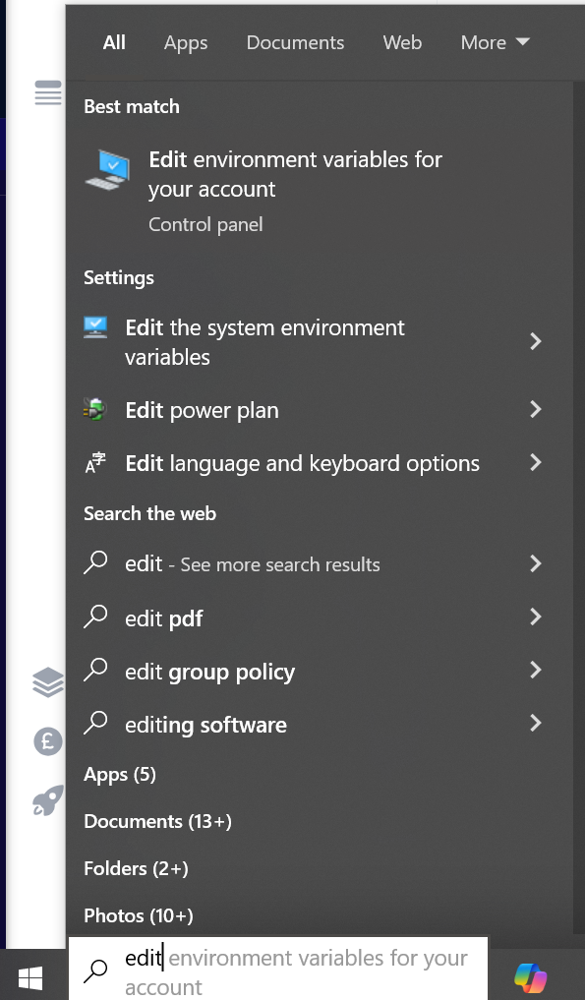
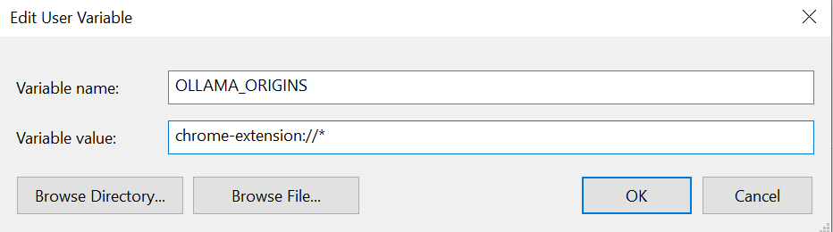
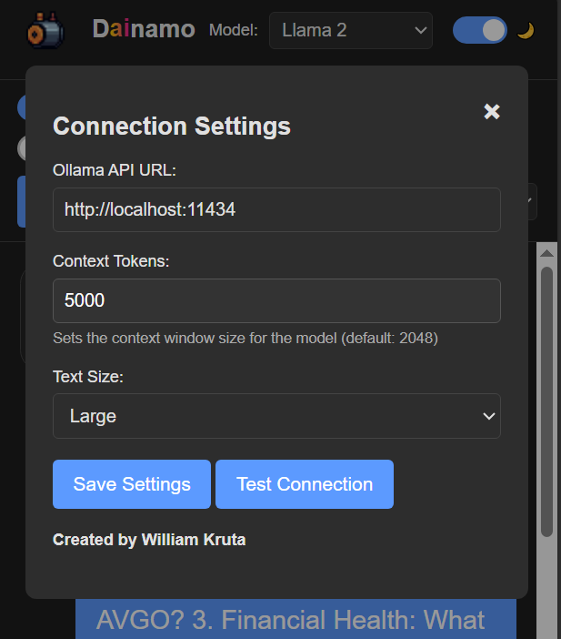

# Overview

`Dainamo` is a chrome extension that interacts with local **Large Language Models (LLMs)** to streamline research for financial assets.

By leveraging the power of LLMs, this extension enables users to:

- Analyze financial news and sentiment
- Identify key drivers and patterns in historical data
- Generate trading ideas and recommendations
- Stay up-to-date with real-time market data and insights

## Features

- [Stock Research](#stock-research)
- [Page Context](#page-context)
- [Memory Usage](#memory-usage)
- [Settings](#settings)

---

# Getting Started

1. Install `Ollama` on your system to run locall llms. You can find the installation [here](https://ollama.com/)

2. Download Language Models to your system. You can find them [here](https://ollama.com/search)

3. Open Chrome and navigate to `chrome://extensions/`.

   - Enable Developer Mode
   - Click "Load unpacked" and select the folder containing this project's files.

4. **Windows**:

   - A. In the Windows menu type "Edit environment variables for your account".
     
   - B. Click "New" to create a new environment variable.
     
   - C. Set the name of the variable as `OLLAMA_ORIGINS` and set its value to `chrome-extension://`.
     

---

# Stock Research

Research stocks without leaving the tab.

---

# Page Context

When enabled, the extension will have access to the current content of the tab you are on. This allows the model to answer questions about the webpage you are currently viewing.

---

# Memory Usage

### On

When memory usage is on, the model will be able to recall past conversations.

### Off

When memory usage is off, the model will be **not** be able to recall past conversations. But it will have a larger **context window**. This could be useful if you need a quick answer for a large piece of text.

---

# Settings

Configure the ollama api url.
Configure the number of context tokens the model uses when responding. The default is 2048.

